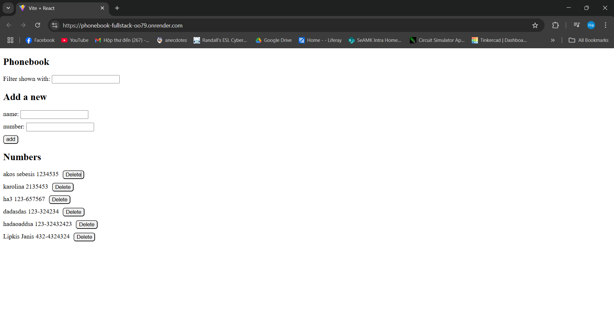

# Phonebook-fullstack

Link to my online application https://phonebook-fullstack-oo79.onrender.com

Link to my repository https://github.com/hadao169/phonebook-fullstack.git

# Link to the repository of PhoneBook Front-End

Note: I’m using Render.com to deploy my app, so the site may go inactive due to inactivity. If it's not accessible, I haven't reactivated it yet.

# Description of Project

1. Viewing Existing Contacts
   Upon accessing the phonebook application, users can view a list of previously added contacts, if any are available.

2. Adding a Contact
   To add a new contact, locate the "Add" button or an input form within the user interface. Selecting this option will prompt you to enter the necessary details, such as the contact’s name and phone number. Once the required information is provided, submit the form to save the contact. Please ensure that the phone number follows the specified format (DDD-DDDDDDD or DD-DDDDDDD) and contains more than eight characters.

3. Editing a Contact:
   To update the phone number of an existing contact, enter the same name with the new number. Submitting this update will replace the existing phone number associated with that contact.

4. Deleting a Contact:
   To remove a contact from the phonebook, locate the "Delete" button or link corresponding to the contact. Selecting this option will trigger a confirmation prompt to verify your decision. Once confirmed, the contact will be permanently removed from the phonebook.

5. Searching and Filtering Contacts:
   If the phonebook application includes search or filtering functionality, users can utilize the search bar or filter options to refine the contact list. Entering a search term or selecting specific criteria will help narrow down the displayed contacts based on the specified parameters.

# Technologies
## Front-end
	* Languages:
  	* HTML
  	* CSS
  	* JavaScript
	* Framework:
  	* ReactJs
## Back-end
	* Language:
  	* JavaScript
  	* Node.js
  * Framework:
    * Express.js
    * Mongoose
  * Database:
    * MongoDB 

